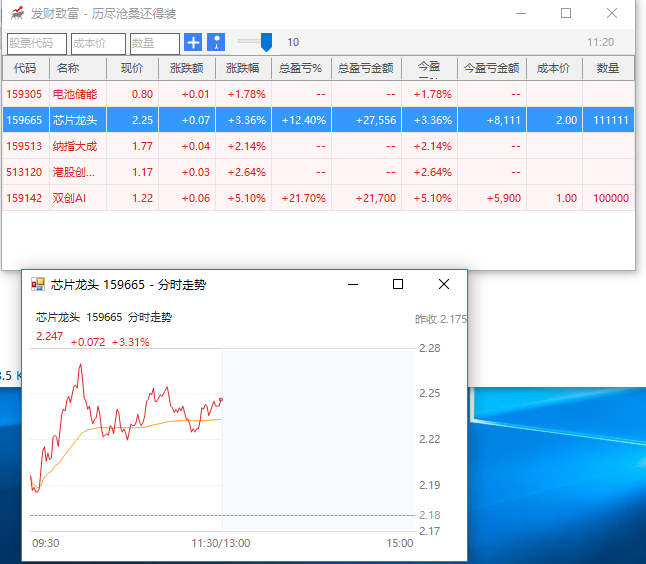

<div align="center">

# 🐂 桌面股市 (DesktopStock)

[](https://github.com/yourname/DesktopStock/releases)
[](https://dotnet.microsoft.com/download/dotnet-framework)
[](https://www.microsoft.com/windows)
[](LICENSE)
[](https://docs.microsoft.com/dotnet/csharp/)

一款专为 A 股投资者打造的 **轻量级桌面股票行情监控工具**。
以最简洁的界面嵌入桌面，实时盯盘、自动刷新盈亏、支持置顶与透明度调节。
让你一眼掌握自选股的全部关键数据。

</div>

---

## 📖 目录

- [✨ 项目特色](#-项目特色)
- [🖼️ 界面预览](#-界面预览)
- [🚀 功能一览](#-功能一览)
- [📦 系统要求](#-系统要求)
- [🔧 安装与运行](#-安装与运行)
- [🛠️ 编译构建](#-编译构建)
- [📂 项目结构](#-项目结构)
- [⚙️ 配置文件说明](#-配置文件说明)
- [🎯 使用指南](#-使用指南)
- [⌨️ 快捷操作](#-快捷操作)
- [🏗️ 架构设计](#-架构设计)
- [📡 数据源](#-数据源)
- [❓ 常见问题 FAQ](#-常见问题-faq)
- [🐛 问题反馈](#-问题反馈)
- [🗺️ 版本历史](#-版本历史)
- [📜 开源协议](#-开源协议)
- [🙏 致谢](#-致谢)

---

## ✨ 项目特色

| 特性 | 描述 |
| --- | --- |
| 🎯 **极致轻量** | 单一 EXE 文件，无任何外部依赖，绿色免安装 |
| 🚀 **启动迅捷** | 冷启动 < 1 秒，几乎无感启动 |
| 🖥️ **桌面嵌入** | 支持窗口置顶与透明度调节，像便利贴一样贴在桌面 |
| 💰 **盈亏实时计算** | 自动计算总盈亏、当日盈亏、百分比和金额 |
| 🖱️ **交互友好** | 列表排序、列宽调整、列显示/隐藏，鼠标右键快捷操作 |
| 💾 **本地持久化** | 全部配置保存到本地 JSON，下次启动自动恢复 |
| 📈 **走势图** | 双击股票即可查看分时/日 K 走势 |
| 🌐 **A 股全覆盖** | 沪深北三大交易所股票代码支持 |

---

## 🖼️ 界面预览
<div align="center">




</div>
### 主窗口

```
┌─────────────────────────────────────────────┐
│  股票代码  成本价  数量  +  📌 ──── 90%  10:23 │
├─────────────────────────────────────────────┤
│  代码  名称  现价  涨跌额  涨跌幅  总盈亏%  …  │
│  600519  贵州茅台  1680.50  +10.20  +0.61% …  │
│  000001  平安银行  12.35    +0.05  +0.41% …  │
│  …                                          │
└─────────────────────────────────────────────┘
```

### 修改成本与数量

```
┌──────────────────────┐
│  修改成本与数量      │
├──────────────────────┤
│  股票：贵州茅台（600519）│
│  成本价：  [1800.00]   │
│  数量：    [  100  ]   │
│       [取消]  [确定]  │
└──────────────────────┘
```

---

## 🚀 功能一览

### 1. 实时行情监控
- ✅ 支持沪深北 A 股（沪市 6 位、深市 0/3 开头、北交所 8 开头）
- ✅ 自动定时刷新（可自定义刷新间隔）
- ✅ 实时显示：现价、涨跌额、涨跌幅
- ✅ 显示股票中文名称

### 2. 盈亏分析
- ✅ **总盈亏**：基于成本价计算持仓盈亏（百分比 + 金额）
- ✅ **今盈亏**：基于当日涨跌计算当日盈亏（百分比 + 金额）
- ✅ 涨红跌绿，符合 A 股显示习惯

### 3. 桌面嵌入
- ✅ 窗口置顶（永远显示在最上层）
- ✅ 透明度可调（30% - 100%）
- ✅ 最小化到系统托盘，不占任务栏
- ✅ 关闭按钮即隐藏到托盘
- ✅ 鼠标穿透式右键菜单

### 4. 自定义列表
- ✅ 列宽可自由拖拽调整，按比例保存
- ✅ 列显示/隐藏（右键列标题弹出菜单）
- ✅ 点击列标题进行排序（升降序切换）
- ✅ 11 列信息：代码、名称、现价、涨跌额、涨跌幅、总盈亏%、总盈亏金额、今盈亏%、今盈亏金额、成本价、数量

### 5. 数据管理
- ✅ 添加/删除股票
- ✅ 修改成本与数量
- ✅ 配置文件本地保存
- ✅ 窗口位置/大小记忆
- ✅ 列宽/列可见性记忆

### 6. 走势图
- ✅ 双击任意股票打开走势图
- ✅ 异步加载，不阻塞主界面

---

## 📦 系统要求

| 项目 | 要求 |
| --- | --- |
| 操作系统 | Windows 7 / 8 / 10 / 11 |
| 运行时 | .NET Framework 4.5 或更高 |
| 内存 | 至少 50 MB 可用 |
| 磁盘 | 至少 5 MB 可用空间 |
| 网络 | 联网（用于获取实时行情） |

> 💡 Windows 10/11 默认已安装 .NET Framework 4.5+，开箱即用。

---

## 🔧 安装与运行

### 方式一：直接运行（推荐）

1. 前往 [Releases](https://github.com/yourname/DesktopStock/releases) 页面
2. 下载最新版本的 `DesktopStock.exe`
3. 双击运行即可，无需安装

### 方式二：源码运行

```bash
# 克隆仓库
git clone https://github.com/yourname/DesktopStock.git
cd DesktopStock/DesktopStock

# 使用 MSBuild 编译
MSBuild DesktopStock.csproj /p:Configuration=Release

# 运行
bin\Release\DesktopStock.exe
```

---

## 🛠️ 编译构建

### 前置条件

- **Visual Studio 2015+** 或 **MSBuild 14.0+**
- **.NET Framework 4.5** SDK

### 命令行编译

#### 使用项目自带脚本

```powershell
# PowerShell
.\build.ps1

# 或批处理
.\build.bat
```

#### 手动编译

```bash
# 定位到项目目录
cd DesktopStock

# 编译 Release 版本
MSBuild DesktopStock.csproj /p:Configuration=Release /t:Build

# 输出位置
# bin\Release\DesktopStock.exe
```

### 项目参数

| 配置 | 平台 | 输出 | 优化 |
| --- | --- | --- | --- |
| Debug | AnyCPU | `bin\Debug\` | 否 |
| Release | AnyCPU | `bin\Release\` | 是 |

---

## 📂 项目结构

```
DesktopStock/
├── 📁 DesktopStock/                  # 主项目目录
│   ├── 📄 Program.cs                  # 程序入口
│   ├── 📄 MainForm.cs                 # 主窗口（核心）
│   ├── 📄 StockItemPanel.cs           # 股票面板（保留备用）
│   ├── 📄 StockService.cs             # 行情数据服务
│   ├── 📄 StockDataStore.cs           # 本地数据持久化
│   ├── 📄 AddStockForm.cs             # 添加股票对话框（保留备用）
│   ├── 📄 EditCostQuantityForm.cs     # 修改成本与数量对话框
│   ├── 📄 ChartForm.cs                # 走势图窗口
│   ├── 📄 DesktopStock.csproj         # 项目文件
│   ├── 📄 App.config                  # 应用程序配置
│   ├── 📄 logo.ico                    # 程序图标
│   ├── 📁 Properties/
│   │   ├── 📄 AssemblyInfo.cs         # 程序集信息（含版本号）
│   │   └── 📄 Resources.resx          # 资源文件
│   └── 📁 bin/
│       ├── 📁 Debug/                  # 调试输出
│       └── 📁 Release/                # 发布输出
│           └── 📄 DesktopStock.exe    # 可执行文件
└── 📄 DesktopStock.sln                # 解决方案文件
```

---

## ⚙️ 配置文件说明

所有用户数据保存到 **程序所在目录** 的 `config.json` 文件中。

### 配置文件结构

```json
{
  "Stocks": [
    {
      "Code": "600519",
      "CostPrice": 1800.00,
      "Quantity": 100
    },
    {
      "Code": "000001",
      "CostPrice": 12.50,
      "Quantity": 1000
    }
  ],
  "ColumnWidths": [8, 10, 7, 8, 8, 9, 11, 9, 11, 8, 7],
  "ColumnVisible": [true, true, true, true, true, true, true, true, true, true, true],
  "Opacity": 0.9,
  "TopMost": true,
  "WindowWidth": 800,
  "WindowHeight": 400,
  "WindowLeft": 100,
  "WindowTop": 100,
  "RefreshInterval": 5
}
```

### 字段说明

| 字段 | 类型 | 说明 | 默认值 |
| --- | --- | --- | --- |
| `Stocks` | Array | 自选股列表 | `[]` |
| └ `Code` | String | 股票代码（6位） | - |
| └ `CostPrice` | Number | 成本价（元） | `0` |
| └ `Quantity` | Number | 持仓数量（股） | `0` |
| `ColumnWidths` | Array | 11 列的宽度权重 | 默认权重 |
| `ColumnVisible` | Array | 11 列是否显示 | `[true,...]` |
| `Opacity` | Number | 窗口透明度 (0.3-1.0) | `0.9` |
| `TopMost` | Boolean | 是否置顶 | `false` |
| `WindowWidth` | Number | 窗口宽度 | `800` |
| `WindowHeight` | Number | 窗口高度 | `400` |
| `WindowLeft` | Number | 窗口 X 坐标 | `100` |
| `WindowTop` | Number | 窗口 Y 坐标 | `100` |
| `RefreshInterval` | Number | 刷新间隔（秒） | `5` |

### 数据迁移

- 删除 `config.json` 即可重置所有设置为默认值
- 旧版本的 `StockCodes` 字符串数组格式会自动迁移到新格式

---

## 🎯 使用指南

### 第一步：添加股票

1. 在顶部工具栏的 **"股票代码"** 输入框中输入 6 位 A 股代码
2. 在 **"成本价"** 输入框中输入你的持仓成本（例如：`12.50`）
3. 在 **"数量"** 输入框中输入你的持仓数量（例如：`1000`）
4. 点击 **+** 按钮或按回车键

> 💡 成本价和数量可以不填，留空时只显示行情不显示盈亏。

### 第二步：查看行情

添加后程序会自动开始刷新行情，每隔 5 秒（可自定义）更新一次。

### 第三步：修改成本与数量

1. 右键点击要修改的股票行
2. 选择 **"修改成本与数量"**
3. 在弹出的对话框中修改（标题会显示 `股票：名称（代码）` 格式）
4. 点击 **确定**

### 第四步：调整显示

- **调整列宽**：拖拽列标题之间的分隔线
- **隐藏/显示列**：右键点击列标题，勾选/取消勾选
- **排序**：左键点击列标题，再点击切换升降序
- **置顶**：点击工具栏的 📌 图标
- **调节透明度**：拖动工具栏的滑块

### 第五步：查看走势

- **双击** 任意股票行打开走势图窗口
- 走势窗口异步加载，不影响主界面

---

## ⌨️ 快捷操作

| 操作 | 快捷键 / 操作方式 |
| --- | --- |
| 添加股票 | 输完代码后按 `回车键` |
| 取消输入 | 按 `Esc 键` |
| 删除股票 | 右键 → 删除股票 |
| 修改成本 | 右键 → 修改成本与数量 |
| 查看走势 | `双击` 股票行 |
| 隐藏窗口 | 点击窗口右上角 `X`（最小化到托盘） |
| 显示窗口 | 点击 `系统托盘图标` |
| 退出程序 | 右键托盘 → 退出 |

---

## 🏗️ 架构设计

### 整体架构

```
┌─────────────────────────────────────────┐
│            MainForm (主窗体)            │
├─────────────────────────────────────────┤
│  工具栏 (ToolBar)                       │
│  ├── 股票代码输入框                      │
│  ├── 成本价输入框                        │
│  ├── 数量输入框                          │
│  ├── 添加按钮 (+)                        │
│  ├── 置顶按钮 (📌)                       │
│  └── 透明度滑块                          │
├─────────────────────────────────────────┤
│  股票列表 (DataGridView)                │
│  └── 11 列 × N 行                       │
├─────────────────────────────────────────┤
│  状态栏 (StatusBar)                     │
│  └── 时间显示 / 状态信息                 │
└─────────────────────────────────────────┘
            ↓
┌─────────────────────────────────────────┐
│          业务逻辑层                       │
├─────────────────────────────────────────┤
│  StockService (行情服务)                 │
│  ├── FetchStocksSync (批量获取)          │
│  └── FetchTrendSync (走势图)             │
├─────────────────────────────────────────┤
│  StockDataStore (持久化)                │
│  ├── Save (保存配置)                     │
│  └── Load (加载配置)                     │
└─────────────────────────────────────────┘
            ↓
┌─────────────────────────────────────────┐
│          数据层                          │
├─────────────────────────────────────────┤
│  config.json (本地文件)                  │
│  └── JSON 序列化/反序列化                 │
└─────────────────────────────────────────┘
```

### 核心类说明

| 类 | 职责 | 关键方法 |
| --- | --- | --- |
| `MainForm` | 主窗口、UI 交互、事件处理 | `ProcessAddCode` `RefreshAllStocksAsync` |
| `StockService` | 调用远程 API 获取行情 | `FetchStocksSync` `FetchTrendSync` |
| `StockDataStore` | 本地 JSON 配置读写 | `Save` `Load` |
| `EditCostQuantityForm` | 修改成本/数量对话框 | `Confirm` |
| `ChartForm` | 走势图窗口 | 显示 K 线/分时数据 |
| `StockConfig` | 单只股票配置（代码、成本、数量） | 数据模型 |
| `StockInfo` | 单只股票实时行情 | 数据模型 |
| `AppSettings` | 全局应用设置 | 数据模型 |

### 数据流转

```
用户输入 → ProcessAddCode()
              ↓
        AddStockToGrid()
              ↓
        SaveSettings() → config.json
              ↓
        定时器触发
              ↓
        RefreshAllStocksAsync()
              ↓
        StockService.FetchStocksSync()
              ↓
        UpdateStockRow() → 更新 DataGridView
```

---

## 📡 数据源

本程序通过 HTTP 请求调用公开的股票行情接口获取数据。

> ⚠️ **免责声明**：本项目仅供学习和个人使用，行情数据来源于第三方公开接口，不保证数据的实时性、准确性和可用性。投资有风险，入市需谨慎。

### 行情接口

- **批量行情**：支持一次请求获取多只股票
- **走势图**：支持分时/日 K 线数据
- **请求频率**：默认 5 秒/次（避免接口频率限制）

---

## ❓ 常见问题 FAQ

<details>
<summary><b>Q1: 程序启动后没有数据？</b></summary>

**A:** 请检查：
1. 网络连接是否正常
2. 输入的股票代码是否正确（6 位数字）
3. 底部状态栏是否显示错误信息
4. 防火墙是否阻止了程序访问网络
</details>

<details>
<summary><b>Q2: 列宽调整后重启丢失？</b></summary>

**A:** 列宽会自动保存到 `config.json`，如果丢失请检查：
1. 程序目录是否有写入权限
2. `config.json` 文件是否被设为只读
</details>

<details>
<summary><b>Q3: 程序关闭后窗口位置变了？</b></summary>

**A:** 关闭按钮（X）只是 **隐藏到托盘**，程序并未真正退出。右键托盘图标 → 退出 才是真正退出程序，窗口位置才会被保存。
</details>

<details>
<summary><b>Q4: 持仓成本和数量忘记填了怎么办？</b></summary>

**A:** 在列表中右键点击该股票 → 选择 **"修改成本与数量"** → 输入正确的数值。
</details>

<details>
<summary><b>Q5: 如何重置所有设置？</b></summary>

**A:** 关闭程序，删除程序目录下的 `config.json` 文件，重新启动程序即可恢复默认设置。
</details>

<details>
<summary><b>Q6: 如何开机自启动？</b></summary>

**A:** 
1. 右键 `DesktopStock.exe` → 创建快捷方式
2. 按 `Win + R` 输入 `shell:startup` 回车
3. 将快捷方式拖入打开的启动文件夹
</details>

<details>
<summary><b>Q7: 支持港股/美股吗？</b></summary>

**A:** 当前版本仅支持沪深北 A 股。港美股需要不同的数据源接口，欢迎提交 PR。
</details>

<details>
<summary><b>Q8: 提示"未能找到或加载主程序集"？</b></summary>

**A:** 请安装 [.NET Framework 4.5 或更高版本](https://dotnet.microsoft.com/download/dotnet-framework/net45)。
</details>

---

## 🐛 问题反馈

如果你在使用过程中遇到问题或有功能建议：

1. 🐞 **Bug 报告**：[GitHub Issues](https://github.com/yourname/DesktopStock/issues)
2. 💡 **功能建议**：[GitHub Discussions](https://github.com/yourname/DesktopStock/discussions)
3. 📧 **邮件联系**：your.email@example.com

### 提交 Issue 请包含

- 操作系统版本（Windows 10/11）
- .NET Framework 版本
- 程序版本号
- 问题描述和复现步骤
- 截图（如有）

---

## 🗺️ 版本历史

### 📌 v2.0.0 (2026-08-04) - 当前版本

**重大更新** 🎉
- ✨ 完全重构股票列表为 DataGridView
- ✨ 新增总盈亏和今盈亏的百分比和金额独立列
- ✨ 新增列标题点击排序功能
- ✨ 新增右键列标题勾选菜单控制列显示/隐藏
- ✨ 列宽等比例自适应窗口
- 🎨 优化修改成本与数量对话框
- 💾 新增列可见性持久化保存
- 🔧 工具栏优化为单行布局

### v1.x.x (历史版本)

- 实现基础行情监控功能
- 实现置顶和透明度调节
- 实现系统托盘功能
- 实现本地数据持久化

---

## 🤝 贡献指南

欢迎所有形式的贡献！

### 如何贡献

1. **Fork** 本仓库
2. 创建你的特性分支 (`git checkout -b feature/AmazingFeature`)
3. 提交你的修改 (`git commit -m 'Add some AmazingFeature'`)
4. 推送到分支 (`git push origin feature/AmazingFeature`)
5. 提交 **Pull Request**

### 代码规范

- 使用 C# 编码规范
- 添加必要的注释
- 确保编译通过
- 测试新功能

### 开发环境

- Visual Studio 2015+
- .NET Framework 4.5
- Windows 10/11

---

## 📜 开源协议

本项目基于 **MIT 协议** 开源。

```
MIT License

Copyright (c) 2024-2026 DesktopStock

Permission is hereby granted, free of charge, to any person obtaining a copy
of this software and associated documentation files (the "Software"), to deal
in the Software without restriction, including without limitation the rights
to use, copy, modify, merge, publish, distribute, sublicense, and/or sell
copies of the Software, and to permit persons to whom the Software is
furnished to do so, subject to the following conditions:

The above copyright notice and this permission notice shall be included in all
copies or substantial portions of the Software.

THE SOFTWARE IS PROVIDED "AS IS", WITHOUT WARRANTY OF ANY KIND, EXPRESS OR
IMPLIED, INCLUDING BUT NOT LIMITED TO THE WARRANTIES OF MERCHANTABILITY,
FITNESS FOR A PARTICULAR PURPOSE AND NONINFRINGEMENT.
```

详见 [LICENSE](LICENSE) 文件。

---

## 🙏 致谢

- 感谢所有提交 Issue 和 PR 的贡献者
- 感谢开源社区提供的各种工具和库
- 特别感谢 [东方财富](https://www.eastmoney.com/)、[新浪财经](https://finance.sina.com.cn/) 等公开数据源

---

## ⭐ Star History

如果这个项目对你有帮助，欢迎点个 ⭐ Star 支持一下！

<div align="center">

**[⬆ 回到顶部](#-桌面股市-desktopstock)**

Made with ❤️ by [DesktopStock Contributors](https://github.com/yourname/DesktopStock/graphs/contributors)

</div>
