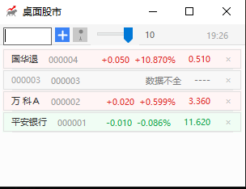
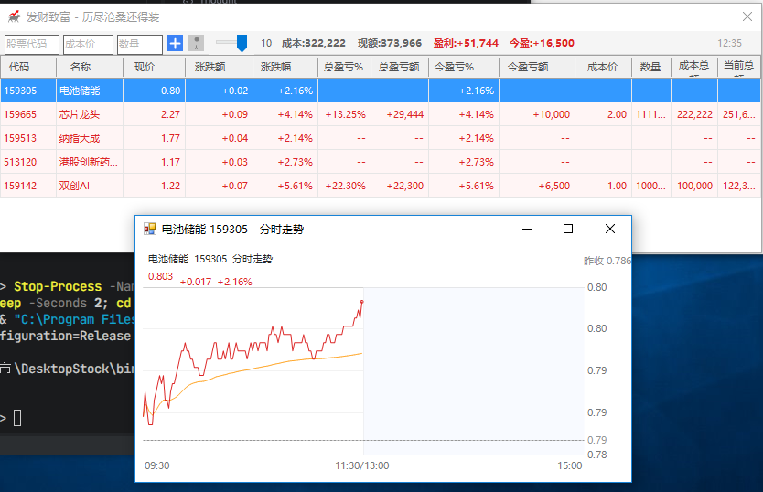
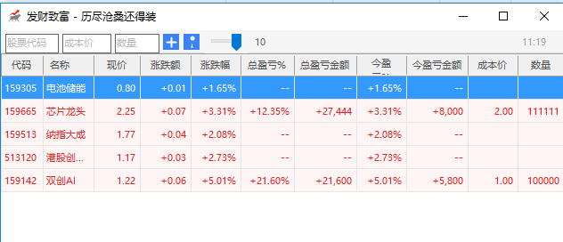

<div align="center">

# 🐂 桌面股市 (DesktopStock)

[](#-版本历史)
[](https://dotnet.microsoft.com/download/dotnet-framework)
[](https://www.microsoft.com/windows)
[](https://docs.microsoft.com/dotnet/csharp/)
[](#-开源协议)

**一款专为 A 股投资者打造的轻量级桌面行情监控工具**

以极简界面嵌入桌面，实时盯盘、自动计算盈亏、支持置顶与透明度调节，
更有**桌面悬浮球**一眼掌握总盈/今盈。沪深北 A 股全覆盖，绿色免安装，开箱即用。

</div>

---

## 📖 目录

- [✨ 项目特色](#-项目特色)
- [🖼️ 界面预览](#-界面预览)
- [🚀 功能一览](#-功能一览)
- [🫧 桌面悬浮球](#-桌面悬浮球)
- [📦 系统要求](#-系统要求)
- [🔧 安装与运行](#-安装与运行)
- [🛠️ 编译构建](#-编译构建)
- [📂 项目结构](#-项目结构)
- [⚙️ 配置文件说明](#-配置文件说明)
- [🎯 使用指南](#-使用指南)
- [⌨️ 快捷操作](#-快捷操作)
- [🏗️ 架构设计](#-架构设计)
- [📡 数据源](#-数据源)
- [❓ 常见问题 FAQ](#-常见问题-faq)
- [🐛 问题反馈](#-问题反馈)
- [🗺️ 版本历史](#-版本历史)
- [🤝 贡献指南](#-贡献指南)
- [📜 开源协议](#-开源协议)
- [🙏 致谢](#-致谢)

---

## ✨ 项目特色

| 特性 | 描述 |
| --- | --- |
| 🎯 **极致轻量** | 单一 EXE 文件，无任何外部依赖，绿色免安装 |
| 🚀 **启动迅捷** | 冷启动 < 1 秒，几乎无感启动 |
| 🖥️ **桌面嵌入** | 窗口置顶 + 透明度可调，像便利贴一样贴在桌面 |
| 🫧 **桌面悬浮球** | 关闭主窗口后浮现迷你球，一眼看总盈/今盈，双击即回主界面 |
| 💰 **盈亏实时计算** | 自动计算总盈亏、今盈亏，并汇总成本/市值/盈利/今盈四项总额 |
| 🖱️ **交互友好** | 列表排序、列宽调整、列显示/隐藏、右键快捷操作 |
| 💾 **本地持久化** | 全部配置保存到本地 JSON，下次启动自动恢复（含悬浮球状态与位置） |
| 📈 **分时走势** | 双击股票查看分时图，含昨收线、均价线、十字光标 |
| 🌐 **A 股全覆盖** | 沪深北三大交易所股票代码支持 |

---

## 🖼️ 界面预览





### 主窗口

```
┌──────────────────────────────────────────────────────────────────┐
│ [股票代码][成本价][数量] [+] [📌] ──────── 90%  [状态] 10:23 │
├──────────────────────────────────────────────────────────────────┤
│  代码   名称    现价    涨跌额  涨跌幅  总盈亏% 总盈亏额 今盈亏% …  │
│  600519 贵州茅台 1680.50 +10.20  +0.61% +5.20% +9360   +0.61% …  │
│  000001 平安银行  12.35  +0.05  +0.41% +2.50% +312    +0.41% …  │
│  …                                                                │
├──────────────────────────────────────────────────────────────────┤
│  成本:1,080,000  现额:1,080,936  盈利:+936  今盈:+1,020          │
└──────────────────────────────────────────────────────────────────┘
```

**工具栏从左到右**：股票代码输入框 / 成本价 / 数量 / 添加按钮(+) / 置顶按钮(📌) / 透明度滑块 / 状态指示。
**底部汇总栏**：成本 / 现额 / 盈利 / 今盈 四项总额（盈利与今盈按 A 股习惯红涨绿跌）。

### 桌面悬浮球

```
        ╭───────────╮
        │  总盈 +9360│
        │  ─────── │
        │  今盈 +1020│
        ╰───────────╯
```

- 正圆白底、无边框、始终置顶，透明度跟随主窗口
- 上半行"总盈"，下半行"今盈"，中间细分隔线，红涨绿跌
- 尺寸随内容自适应，可拖动到任意位置并记忆

### 修改成本与数量

```
┌────────────────────────────┐
│  修改成本与数量             │
├────────────────────────────┤
│  股票：贵州茅台（600519）   │
│  成本价：  [ 1800.00 ]      │
│  数量：    [   100  ]       │
│         [取消]    [确定]    │
└────────────────────────────┘
```

### 分时走势图

```
┌──────────────────────────────────────┐
│  贵州茅台 600519        10:23  1680.50│
│ ─ ─ ─ ─ ─ ─ 昨收 1670.30 ─ ─ ─ ─ ─ ─│
│       ╱╲       ╱╲      ← 分时线       │
│      ╱  ╲     ╱  ╲     ─ ─ 均价线     │
│   ──╱────╲───╱────╲────                │
│  ╱        ╲_╱      ╲                  │
│ 9:30        12:00       15:00         │
│  悬停：时间 1680.50  均1678.20  量1234 │
└──────────────────────────────────────┘
```

---

## 🚀 功能一览

### 1. 实时行情监控
- ✅ 支持沪深北 A 股（沪市 6/5 开头、深市 0/2/3/1 开头、北交所 8/4 开头）
- ✅ 自动定时刷新（默认 5 秒，可自定义 2–60 秒）
- ✅ 实时显示：现价、涨跌额、涨跌幅、股票中文名称
- ✅ 底部状态栏显示刷新时间与错误信息

### 2. 盈亏分析
- ✅ **总盈亏**：基于成本价计算持仓盈亏（百分比 + 金额）
- ✅ **今盈亏**：基于当日涨跌计算当日盈亏（百分比 + 金额）
- ✅ **四项汇总**：底部工具栏实时汇总 `成本 / 现额 / 盈利 / 今盈`
- ✅ 涨红跌绿，符合 A 股显示习惯

### 3. 桌面悬浮球
- ✅ 关闭主窗口后自动浮现（可在托盘菜单关闭该功能）
- ✅ 显示总盈 / 今盈两项核心数据
- ✅ 双击悬浮球一键回到主界面
- ✅ 自由拖动、位置记忆、状态持久化（重启自动恢复）

### 4. 桌面嵌入
- ✅ 窗口置顶（永远显示在最上层）
- ✅ 透明度可调（30% – 100%）
- ✅ 不占任务栏，驻留系统托盘
- ✅ 标题栏仅保留关闭按钮，关闭即隐藏到托盘

### 5. 自定义列表
- ✅ 列宽可自由拖拽调整，按比例保存
- ✅ 列显示/隐藏（右键列标题弹出菜单）
- ✅ 点击列标题进行排序（升/降序切换）
- ✅ 11 列信息：代码、名称、现价、涨跌额、涨跌幅、总盈亏%、总盈亏额、今盈亏%、今盈亏额、成本价、数量

### 6. 数据管理
- ✅ 添加 / 删除股票，修改成本与数量
- ✅ 配置文件本地保存
- ✅ 窗口位置 / 大小 / 透明度 / 置顶 / 刷新间隔全部记忆
- ✅ 列宽 / 列可见性记忆
- ✅ 配置导出 / 导入 / 一键重置

### 7. 分时走势
- ✅ 双击任意股票打开分时图
- ✅ 含昨收参考线、均价线、十字光标
- ✅ 鼠标悬停查看时间/价格/均价/成交量
- ✅ 异步加载，不阻塞主界面

---

## 🫧 桌面悬浮球

悬浮球是 2.0.0 版本的核心特性，让你在主窗口隐藏时仍能一眼掌握盈亏。

### 工作流程

```
        关闭主窗口(X)                双击悬浮球
   ┌──────────────────┐        ┌──────────────────┐
   │  主窗口隐藏到托盘  │        │  打开主窗口       │
   │  悬浮球自动浮现   │  ←──→  │  悬浮球自动隐藏   │
   └──────────────────┘        └──────────────────┘
```

### 操作说明

| 操作 | 效果 |
| --- | --- |
| 双击悬浮球 | 打开主窗口（悬浮球自动隐藏，避免重复显示） |
| 右键 → 显示主窗口 | 同上，打开主窗口 |
| 右键 → 隐藏悬浮球 | 仅隐藏悬浮球（不影响主窗口） |
| 拖动悬浮球 | 移动到任意位置，松开自动记忆坐标 |
| 托盘菜单 → 显示悬浮球 | 勾选/取消以开关悬浮球功能，状态持久化 |

### 显示规则
- 悬浮球为**正圆白底、无边框、始终置顶**，透明度与主窗口同步
- 上半行显示 `总盈 ±金额`，下半行显示 `今盈 ±金额`
- 颜色遵循 A 股习惯：**红涨绿跌**（盈利为红，亏损为绿，持平为灰）
- 尺寸根据文本长度自适应（最小 72×72），保证完整显示不溢出
- 仅当主窗口隐藏到托盘且 `ShowFloatingBall=true` 时自动浮现

---

## 📦 系统要求

| 项目 | 要求 |
| --- | --- |
| 操作系统 | Windows 7 / 8 / 10 / 11 |
| 运行时 | .NET Framework 4.5 或更高 |
| 内存 | 至少 50 MB 可用 |
| 磁盘 | 至少 5 MB 可用空间 |
| 网络 | 联网（用于获取实时行情） |

> 💡 Windows 10/11 默认已安装 .NET Framework 4.5+，开箱即用。

---

## 🔧 安装与运行

### 方式一：直接运行（推荐）

1. 前往 [Releases](../../releases) 页面
2. 下载最新版本的 `DesktopStock.exe`
3. 双击运行即可，无需安装

### 方式二：源码运行

```bash
# 克隆仓库
git clone https://github.com/yourname/DesktopStock.git
cd DesktopStock/DesktopStock

# 使用 MSBuild 编译 Release 版本
MSBuild DesktopStock.csproj /p:Configuration=Release

# 运行
bin\Release\DesktopStock.exe
```

---

## 🛠️ 编译构建

### 前置条件

- **Visual Studio 2015+** 或 **MSBuild 14.0+**
- **.NET Framework 4.5** SDK（目标框架 `v4.5`）

### 命令行编译

```bash
# 定位到项目目录
cd DesktopStock

# 编译 Release 版本（推荐，使用 .csproj 以包含全部源文件）
MSBuild DesktopStock.csproj /p:Configuration=Release /t:Build

# 输出位置
# bin\Release\DesktopStock.exe
```

<details>
<summary><b>📋 关于项目自带的 build.bat / build.ps1</b></summary>

> ⚠️ 仓库内的 `build.bat` 为早期脚本，其源文件列表未包含 `FloatingBall.cs`、`ChartForm.cs`、`AddStockForm.cs` 等后期新增文件，直接运行会编译失败。**推荐使用上方的 `MSBuild DesktopStock.csproj` 方式**，`.csproj` 已包含全部源文件，构建更可靠。

</details>

### 构建配置

| 配置 | 平台 | 输出目录 | 优化 |
| --- | --- | --- | --- |
| Debug | AnyCPU | `bin\Debug\` | 否 |
| Release | AnyCPU | `bin\Release\` | 是 |

---

## 📂 项目结构

```
桌面股市/
├── 📄 DesktopStock.sln                 # 解决方案文件
├── 📄 README.md                        # 本文档
├── 📄 logo.png                         # 项目 Logo
└── 📁 DesktopStock/                    # 主项目目录
    ├── 📄 Program.cs                   # 程序入口（启用 TLS 1.2）
    ├── 📄 MainForm.cs                  # 主窗口（核心：UI、交互、定时刷新、托盘、悬浮球）
    ├── 📄 FloatingBall.cs              # 桌面悬浮球控件
    ├── 📄 ChartForm.cs                 # 分时走势图窗口
    ├── 📄 StockService.cs              # 行情数据服务（新浪/腾讯接口）
    ├── 📄 StockDataStore.cs            # 本地 JSON 持久化（含 AppSettings/StockConfig/StockInfo）
    ├── 📄 EditCostQuantityForm.cs      # 修改成本与数量对话框
    ├── 📄 AddStockForm.cs              # 添加股票对话框（旧版，已由顶部输入框取代）
    ├── 📄 StockItemPanel.cs            # 股票面板控件（旧版，保留备用）
    ├── 📄 DesktopStock.csproj          # 项目文件（目标框架 v4.5）
    ├── 📄 App.config                   # 应用程序配置
    ├── 📄 logo.ico                     # 程序图标
    ├── � build.bat / build.ps1        # 早期构建脚本（见上方说明）
    ├── �📁 Properties/
    │   ├── 📄 AssemblyInfo.cs          # 程序集信息（版本 2.0.0.0）
    │   └── 📄 Resources.resx           # 资源文件
    └── 📁 bin/
        ├── 📁 Debug/                   # 调试输出
        └── 📁 Release/                 # 发布输出
            └── 📄 DesktopStock.exe     # 可执行文件
```

---

## ⚙️ 配置文件说明

所有用户数据保存到用户目录下的 `settings.json`：

```
%LOCALAPPDATA%\DesktopStock\settings.json
```

> 💡 通常完整路径为 `C:\Users\<用户名>\AppData\Local\DesktopStock\settings.json`。
> `AppData` 是隐藏文件夹，可在资源管理器地址栏直接粘贴 `%LOCALAPPDATA%\DesktopStock` 回车打开。

### 配置文件结构

```json
{
  "WindowWidth": 800,
  "WindowHeight": 400,
  "WindowLeft": 100,
  "WindowTop": 100,
  "Opacity": 0.90,
  "TopMost": false,
  "RefreshInterval": 5,
  "ShowFloatingBall": false,
  "FloatingBallX": -1,
  "FloatingBallY": -1,
  "Stocks": [
    { "Code": "600519", "CostPrice": 1800.00, "Quantity": 100 },
    { "Code": "000001", "CostPrice": 12.50,  "Quantity": 1000 }
  ],
  "ColumnWidths": [8, 10, 7, 8, 8, 9, 11, 9, 11, 8, 7],
  "ColumnVisible": [true, true, true, true, true, true, true, true, true, true, true]
}
```

### 字段说明

| 字段 | 类型 | 说明 | 默认值 |
| --- | --- | --- | --- |
| `Stocks` | Array | 自选股列表 | `[]` |
| └ `Code` | String | 股票代码（6 位） | — |
| └ `CostPrice` | Number | 成本价（元） | `0` |
| └ `Quantity` | Number | 持仓数量（股） | `0` |
| `ColumnWidths` | Array | 11 列的宽度权重（FillWeight） | 默认权重 |
| `ColumnVisible` | Array | 11 列是否显示 | 全 `true` |
| `Opacity` | Number | 窗口透明度 (0.3–1.0) | `0.9` |
| `TopMost` | Boolean | 是否窗口置顶 | `false` |
| `WindowWidth` | Number | 窗口宽度 | `320` |
| `WindowHeight` | Number | 窗口高度 | `240` |
| `WindowLeft` | Number | 窗口 X 坐标 | `100` |
| `WindowTop` | Number | 窗口 Y 坐标 | `100` |
| `RefreshInterval` | Number | 刷新间隔（秒，2–60） | `5` |
| `ShowFloatingBall` | Boolean | 是否启用悬浮球（重启后据此恢复） | `false` |
| `FloatingBallX` | Number | 悬浮球 X 坐标（-1 表示默认位置） | `-1` |
| `FloatingBallY` | Number | 悬浮球 Y 坐标（-1 表示默认位置） | `-1` |

### 配置管理

程序在系统托盘右键菜单中提供完整的配置管理：

- **打开配置目录**：在资源管理器中打开 `settings.json` 所在文件夹
- **导出配置**：将当前 `settings.json` 另存为外部文件，便于备份/迁移
- **导入配置**：从外部文件载入配置并立即生效
- **重置所有设置**：清空配置恢复默认值（需谨慎）

### 数据迁移与重置

- 旧版本的 `StockCodes` 字符串数组格式会自动迁移到新的 `Stocks` 对象数组
- 删除 `settings.json` 即可重置所有设置为默认值

---

## 🎯 使用指南

### 第一步：添加股票

1. 在顶部工具栏的 **"股票代码"** 输入框中输入 6 位 A 股代码
2. 在 **"成本价"** 输入框中输入你的持仓成本（例如：`12.50`）
3. 在 **"数量"** 输入框中输入你的持仓数量（例如：`1000`）
4. 点击 **+** 按钮或按 `回车键`

> 💡 成本价和数量可以不填，留空时只显示行情不显示盈亏。

### 第二步：查看行情

添加后程序会自动开始刷新行情，每隔 5 秒（可自定义）更新一次。
底部工具栏会实时汇总 **成本 / 现额 / 盈利 / 今盈** 四项总额。

### 第三步：修改成本与数量

1. 右键点击要修改的股票行
2. 选择 **"修改成本与数量"**
3. 在弹出的对话框中修改（标题会显示 `股票：名称（代码）`）
4. 点击 **确定**

### 第四步：调整显示

- **调整列宽**：拖拽列标题之间的分隔线
- **隐藏/显示列**：右键点击列标题，勾选/取消勾选
- **排序**：左键点击列标题，再次点击切换升降序
- **置顶**：点击工具栏的 📌 图标
- **调节透明度**：拖动工具栏的滑块

### 第五步：查看分时走势

- **双击** 任意股票行打开分时图窗口
- 鼠标在图上悬停可查看对应时间点的价格、均价、成交量
- 走势窗口异步加载，不影响主界面

### 第六步：使用悬浮球

1. 点击窗口右上角 **X** 关闭主窗口（程序隐藏到托盘）
2. 悬浮球自动浮现于桌面（需 `ShowFloatingBall` 开启）
3. **双击悬浮球** 即可回到主窗口
4. 拖动悬浮球可调整位置，松开后自动记忆

---

## ⌨️ 快捷操作

| 操作 | 快捷键 / 操作方式 |
| --- | --- |
| 添加股票 | 输完代码后按 `回车键` |
| 删除股票 | 右键股票行 → 删除股票 |
| 修改成本 | 右键股票行 → 修改成本与数量 |
| 查看分时走势 | `双击` 股票行 |
| 置顶/取消置顶 | 点击工具栏 📌 图标 |
| 隐藏主窗口 | 点击窗口右上角 `X`（隐藏到托盘） |
| 显示主窗口 | `双击` 托盘图标 / 托盘左键单击 / 双击悬浮球 |
| 开关悬浮球 | 托盘右键 → 显示悬浮球（勾选/取消） |
| 移动悬浮球 | 按住悬浮球拖动 |
| 退出程序 | 托盘右键 → 退出 |

### 系统托盘右键菜单

```
┌────────────────────┐
│  显示主窗口         │
├────────────────────┤
│  ✓ 显示悬浮球       │   ← 可勾选项，开关悬浮球
├────────────────────┤
│  打开配置目录       │
│  导出配置           │
│  导入配置           │
│  重置所有设置       │
├────────────────────┤
│  退出               │
└────────────────────┘
```

---

## 🏗️ 架构设计

### 整体架构

```
┌─────────────────────────────────────────────────┐
│                  MainForm (主窗体)                │
├─────────────────────────────────────────────────┤
│  工具栏：代码/成本/数量输入 · 添加 · 置顶 · 透明度 │
│  股票列表：DataGridView (11 列 × N 行)            │
│  汇总栏：成本 / 现额 / 盈利 / 今盈                │
├─────────────────────────────────────────────────┤
│  FloatingBall (悬浮球) · NotifyIcon (托盘)        │
└─────────────────────────────────────────────────┘
                       ↓
┌─────────────────────────────────────────────────┐
│                   业务逻辑层                      │
├─────────────────────────────────────────────────┤
│  StockService  ── 行情服务（新浪/腾讯接口）        │
│    ├ FetchStocksSync  批量获取实时行情            │
│    └ FetchTrendSync   获取分时走势                │
│  StockDataStore ── 本地 JSON 持久化               │
│    ├ Save / Load      读写 settings.json          │
│    └ 手动 JSON 解析    无第三方序列化库            │
└─────────────────────────────────────────────────┘
                       ↓
┌─────────────────────────────────────────────────┐
│                    数据层                         │
├─────────────────────────────────────────────────┤
│  %LOCALAPPDATA%\DesktopStock\settings.json       │
│  新浪行情接口 · 腾讯分时接口                       │
└─────────────────────────────────────────────────┘
```

### 核心类说明

| 类 | 职责 | 关键成员 |
| --- | --- | --- |
| `MainForm` | 主窗口、UI 交互、定时刷新、托盘、悬浮球编排 | `LoadAndApplySettings` `RefreshAllStocks` `ShowFloatingBall` `ShowMainWindow` |
| `FloatingBall` | 桌面悬浮球控件 | `SetValuesAndResize` `OpenMainWindowRequested` 事件 |
| `ChartForm` | 分时走势图窗口 | 自绘分时/均价线、十字光标 |
| `StockService` | 调用远程 API 获取行情 | `FetchStocksSync` `FetchTrendSync` `ParseStockData` |
| `StockDataStore` | 本地 JSON 配置读写（手动解析） | `Save` `Load` |
| `EditCostQuantityForm` | 修改成本/数量对话框 | 输入验证、确认回调 |
| `StockConfig` | 单只股票配置（代码、成本、数量） | 数据模型 |
| `StockInfo` | 单只股票实时行情 | `Price` `ChangeAmount` `ChangePercent` 等 |
| `AppSettings` | 全局应用设置 | 含 `ShowFloatingBall` `FloatingBallX/Y` 等 |

### 数据流转

```
用户输入代码 ──→ AddStockFromInput()
                      │
                      ↓
              AddStockToGrid() ──→ SaveSettings() ──→ settings.json
                      │
                 定时器触发 (每 N 秒)
                      ↓
              RefreshAllStocks()
                      ↓
         StockService.FetchStocksSync()  ── HTTPS ──→ 新浪行情接口
                      ↓
         UpdateStockRow() ──→ 更新 DataGridView
                      ↓
         UpdateSummaryStats() ──→ 更新汇总栏 + 悬浮球
```

### 关键设计要点

- **零第三方依赖**：JSON 序列化/反序列化全部手写，无需引入 Newtonsoft.Json 等
- **TLS 1.2 预启用**：`Program.cs` 在任何 HTTP 请求前强制开启 TLS 1.2/1.1/1.0，兼容新浪/腾讯 HTTPS 接口
- **防抖保存**：窗口拖拽/缩放时 300ms 防抖写入，避免频繁 IO
- **原子写入**：配置先写 `.tmp` 再替换，防止写入中断导致文件损坏
- **状态恢复**：启动时按 `settings.json` 恢复窗口位置/大小、列宽/可见性、悬浮球状态与位置

---

## 📡 数据源

本程序通过 HTTP 请求调用公开的股票行情接口获取数据。

> ⚠️ **免责声明**：本项目仅供学习和个人使用，行情数据来源于第三方公开接口，不保证数据的实时性、准确性和可用性。投资有风险，入市需谨慎。

### 实时行情（新浪财经）

- **接口**：`https://hq.sinajs.cn/list=<符号1>,<符号2>,...`
- **方式**：GET，支持批量请求（多只股票一次获取）
- **请求头**：`Referer: https://finance.sina.com.cn/`、`User-Agent: Mozilla/5.0 ...`
- **超时**：10 秒

### 分时走势（腾讯财经）

- **接口**：`https://web.ifzq.gtimg.cn/appstock/app/minute/query?_var=&code=<符号>`
- **方式**：GET，单只股票分时数据

### 代码 → 接口符号映射

| 股票代码前缀 | 交易所 | 符号前缀 | 示例 |
| --- | --- | --- | --- |
| `6` / `5` | 上海证券交易所（股票 / ETF） | `sh` | `600519` → `sh600519` |
| `0` / `2` / `3` / `1` | 深圳证券交易所（主板/中小板/创业板/ETF） | `sz` | `000001` → `sz000001` |
| `8` / `4` | 北京证券交易所 | `bj` | `830879` → `bj830879` |

### 解析字段

新浪返回的行情字符串按逗号分隔，程序解析出以下字段：

| 字段 | 含义 |
| --- | --- |
| `Name` | 股票名称 |
| `Price` | 当前价格 |
| `PrevClose` | 昨日收盘价 |
| `ChangeAmount` | 涨跌额（= 现价 − 昨收） |
| `ChangePercent` | 涨跌幅 %（= (现价 − 昨收) / 昨收 × 100） |
| `UpdateTime` | 更新时间 |
| `IsValid` | 数据是否有效 |

---

## ❓ 常见问题 FAQ

<details>
<summary><b>Q1: 程序启动后没有数据？</b></summary>

**A:** 请检查：
1. 网络连接是否正常
2. 输入的股票代码是否正确（6 位数字）
3. 底部状态栏是否显示错误信息
4. 防火墙是否阻止了程序访问网络
</details>

<details>
<summary><b>Q2: 关闭窗口后程序还在运行吗？</b></summary>

**A:** 是的。点击窗口右上角 `X` 只是**隐藏到系统托盘**，程序并未退出。
- 主窗口隐藏后会自动浮现悬浮球（若已开启）
- 双击托盘图标或双击悬浮球可恢复主窗口
- 右键托盘图标 → 退出，才是真正退出程序
</details>

<details>
<summary><b>Q3: 悬浮球重启后不显示了？</b></summary>

**A:** 2.0.0 已修复该问题。悬浮球开关状态会保存到 `settings.json` 的 `ShowFloatingBall` 字段，重启后自动恢复。若仍不显示，请在托盘右键菜单勾选 **"显示悬浮球"**。
</details>

<details>
<summary><b>Q4: 双击悬浮球为什么主窗口没打开？</b></summary>

**A:** 2.0.0 已修复该问题。早期版本双击悬浮球只会隐藏球本身，现已改为**双击悬浮球打开主窗口**（球随之自动隐藏，避免重复显示）。
</details>

<details>
<summary><b>Q5: 列宽/列显示调整后重启丢失？</b></summary>

**A:** 列宽与列可见性会自动保存到 `settings.json`（`ColumnWidths` / `ColumnVisible`）。如果丢失请检查：
1. `%LOCALAPPDATA%\DesktopStock\` 目录是否有写入权限
2. `settings.json` 文件是否被设为只读
</details>

<details>
<summary><b>Q6: 持仓成本和数量忘记填了怎么办？</b></summary>

**A:** 在列表中右键点击该股票 → 选择 **"修改成本与数量"** → 输入正确的数值 → 确定。
</details>

<details>
<summary><b>Q7: 如何重置所有设置？</b></summary>

**A:** 两种方式：
1. 托盘右键 → **重置所有设置**
2. 关闭程序，删除 `%LOCALAPPDATA%\DesktopStock\settings.json`，重新启动
</details>

<details>
<summary><b>Q8: 如何开机自启动？</b></summary>

**A:**
1. 右键 `DesktopStock.exe` → 创建快捷方式
2. 按 `Win + R` 输入 `shell:startup` 回车
3. 将快捷方式拖入打开的启动文件夹
</details>

<details>
<summary><b>Q9: 支持港股/美股吗？</b></summary>

**A:** 当前版本仅支持沪深北 A 股。港美股需要不同的数据源接口，欢迎提交 PR。
</details>

<details>
<summary><b>Q10: 提示"未能找到或加载主程序集"？</b></summary>

**A:** 请安装 [.NET Framework 4.5 或更高版本](https://dotnet.microsoft.com/download/dotnet-framework/net45)。
</details>

---

## 🐛 问题反馈

如果你在使用过程中遇到问题或有功能建议：

1. 🐞 **Bug 报告**：[GitHub Issues](../../issues)
2. 💡 **功能建议**：[GitHub Discussions](../../discussions)

### 提交 Issue 请包含

- 操作系统版本（Windows 10/11）
- .NET Framework 版本
- 程序版本号（见关于/程序集信息）
- 问题描述和复现步骤
- 截图（如有）
- 底部状态栏的错误提示文本（如有）

---

## 🗺️ 版本历史

### 📌 v2.0.0 (2026-08-04) — 当前版本

**重大更新** 🎉

**新特性**
- ✨ **桌面悬浮球**：关闭主窗口后浮现迷你球，显示总盈/今盈，双击回到主界面，可拖动、位置记忆、状态持久化
- ✨ **今盈汇总**：底部工具栏新增"今盈"总额统计，实时计算全部持仓的当日盈亏
- ✨ 分时走势图：含昨收参考线、均价线、十字光标、悬停详情
- ✨ 系统托盘菜单：新增"显示悬浮球"开关、"打开配置目录"、"导出/导入配置"、"重置所有设置"

**重构与优化**
- ✨ 完全重构股票列表为 DataGridView
- ✨ 新增总盈亏和今盈亏的百分比和金额独立列（共 11 列）
- ✨ 新增列标题点击排序功能
- ✨ 新增右键列标题勾选菜单控制列显示/隐藏
- ✨ 列宽等比例自适应窗口
- 🎨 优化修改成本与数量对话框
-  工具栏优化为单行布局，汇总四项总额
- 🔒 程序启动强制启用 TLS 1.2，兼容新版行情接口

**问题修复**
- 🐛 修复悬浮球开关状态重启后丢失的问题
- 🐛 修复双击悬浮球未打开主窗口、仅隐藏球自身的问题
- 🐛 修复主窗口隐藏到托盘后恢复时位置/大小丢失的问题
- 🐛 隐藏最小化与最大化按钮，标题栏仅保留关闭按钮，关闭即驻留托盘

### v1.x.x (历史版本)

- 实现基础行情监控功能
- 实现置顶和透明度调节
- 实现系统托盘功能
- 实现本地数据持久化

---

## 🤝 贡献指南

欢迎所有形式的贡献！

### 如何贡献

1. **Fork** 本仓库
2. 创建你的特性分支 (`git checkout -b feature/AmazingFeature`)
3. 提交你的修改 (`git commit -m 'Add some AmazingFeature'`)
4. 推送到分支 (`git push origin feature/AmazingFeature`)
5. 提交 **Pull Request**

### 代码规范

- 遵循 C# 编码规范
- 添加必要的中文注释
- 确保编译通过（推荐使用 `MSBuild DesktopStock.csproj`）
- 测试新功能不影响既有流程

### 开发环境

- Visual Studio 2015+ 或 MSBuild 14.0+
- .NET Framework 4.5 SDK
- Windows 10/11

---

## 📜 开源协议

本项目基于 **MIT 协议** 开源。

```
MIT License

Copyright (c) 2024-2026 DesktopStock

Permission is hereby granted, free of charge, to any person obtaining a copy
of this software and associated documentation files (the "Software"), to deal
in the Software without restriction, including without limitation the rights
to use, copy, modify, merge, publish, distribute, sublicense, and/or sell
copies of the Software, and to permit persons to whom the Software is
furnished to do so, subject to the following conditions:

The above copyright notice and this permission notice shall be included in all
copies or substantial portions of the Software.

THE SOFTWARE IS PROVIDED "AS IS", WITHOUT WARRANTY OF ANY KIND, EXPRESS OR
IMPLIED, INCLUDING BUT NOT LIMITED TO THE WARRANTIES OF MERCHANTABILITY,
FITNESS FOR A PARTICULAR PURPOSE AND NONINFRINGEMENT.
```

---

## 🙏 致谢

- 感谢所有提交 Issue 和 PR 的贡献者
- 感谢开源社区提供的各种工具和库
- 特别感谢 [新浪财经](https://finance.sina.com.cn/)、[腾讯财经](https://gu.qq.com/) 等公开数据源

---

## ⭐ Star History

如果这个项目对你有帮助，欢迎点个 ⭐ Star 支持一下！

<div align="center">

**[⬆ 回到顶部](#-桌面股市-desktopstock)**

Made with ❤️ by DesktopStock Contributors

</div>
